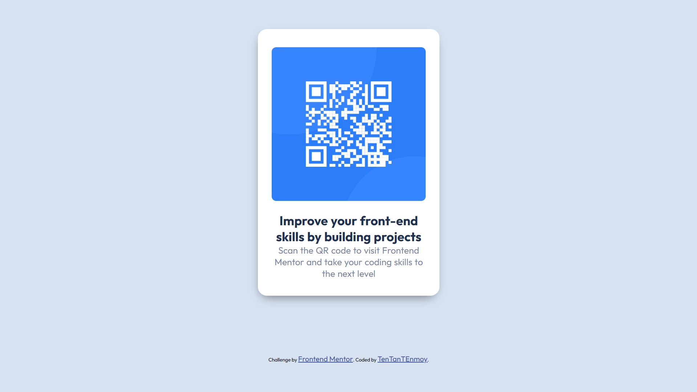

# Frontend Mentor - QR Code Component Solution

This is a solution to the [QR code component challenge on Frontend Mentor](https://www.frontendmentor.io/challenges/qr-code-component-iux_sIO_H). Frontend Mentor challenges help you improve your coding skills by building realistic projects.

## Table of Contents

- [Overview](#overview)
  - [Screenshot](#screenshot)
  - [Links](#links)
- [My Process](#my-process)
  - [Built With](#built-with)
  - [What I Learned](#what-i-learned)
  - [Continued Development](#continued-development)
  - [Useful Resources](#useful-resources)
- [Author](#author)
- [Acknowledgments](#acknowledgments)

## Overview

This project is a solution to the QR Code Component challenge from Frontend Mentor. It consists of a responsive, accessible QR code component with a clean and simple design. The challenge focuses on building a small component, making it perfect for practicing basic HTML and CSS skills. The QR code image is centered in the viewport, and the design is optimized for both desktop and mobile devices.

The goal of this project is to demonstrate the ability to use Flexbox for layout, maintain mobile-first design principles, and ensure that the design is both visually appealing and functional across devices.

### Screenshot



### Links

- Solution URL: [Frontend Mentor Solution](https://www.frontendmentor.io/solutions/qr-code-component)
- Live Site URL: [Live Site](https://your-live-site-url.com)

## My Process

### Built With

- Semantic HTML5 markup
- CSS custom properties
- Flexbox
- CSS Grid
- Mobile-first workflow

### What I Learned

During this challenge, I improved my understanding of using `display: flex;` for centering elements. Below is an example of how I centered the QR code component:

```css
.container {
  display: flex;
  align-items: center;
  justify-content: center;
  height: 100vh;
  background-color: #f0f0f0;
}
```

This challenge also reinforced the importance of a mobile-first workflow when designing responsive components.

### Continued Development

Going forward, I want to:

- Improve my CSS Grid skills for better layout management.
- Experiment with CSS animations to enhance user experience.
- Explore better ways to structure reusable components in future projects.

### Useful Resources

- [CSS Tricks - Flexbox Guide](https://css-tricks.com/snippets/css/a-guide-to-flexbox/) - Helped me understand how to properly use Flexbox.
- [MDN Web Docs - HTML & CSS](https://developer.mozilla.org/) - Great reference for HTML and CSS concepts.

## Author

- Frontend Mentor - not provided
- GitHub - [@yourgithub](https://github.com/Ten-T-Tonmoy)
- Twitter - not provided

## Acknowledgments

Thanks to the Frontend Mentor community for feedback and inspiration while working on this challenge.
